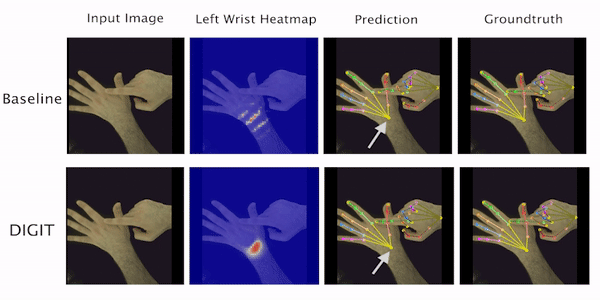

# Learning to Disambiguate Strongly Interacting Hands via Probabilistic Per-Pixel Part Segmentation [3DV 2021 Oral]

[](https://zc-alexfan.github.io/digit/)
[](https://arxiv.org/abs/2104.08527)

> [**Learning to Disambiguate Strongly Interacting Hands via Probabilistic Per-Pixel Part Segmentation**](https://arxiv.org/abs/2107.00434),            
> [Zicong Fan](https://ait.ethz.ch/people/zfan), 
> [Adrian Spurr](https://ait.ethz.ch/people/spurra), 
> [Muhammed Kocabas](https://ps.is.tuebingen.mpg.de/person/mkocabas), 
> [Siyu Tang](https://vlg.inf.ethz.ch/people/person-detail.siyutang.html),
> [Michael J. Black](https://ps.is.tuebingen.mpg.de/person/black),
> [Otmar Hilliges](https://ait.ethz.ch/people/hilliges)
> International Conference on 3D Vision (3DV), 2021

<p align="center">
    
</p>

## Features

DIGIT estimates the 3D poses of two interacting hands from a single RGB image. This repo provides the training, evaluation, and demo code for the project in PyTorch Lightning.

## Updates

- November 25 2021: Initial repo with training and evaluation on PyTorch Lightning 0.9.


## Setting up environment

DIGIT has been implemented and tested on Ubuntu 18.04 with python >= 3.7, PyTorch Lightning 0.9 and PyTorch 1.6.

Clone the repo:

```
git clone https://github.com/zc-alexfan/digit-interacting
```

Create folders needed:
```
make folders
```

Install conda environment:

```
conda create -n digit python=3.7
conda deactivate
conda activate digit
conda install pytorch==1.6.0 torchvision==0.7.0 cudatoolkit=10.1 -c pytorch
pip install -r requirements.txt
```


## Downloading InterHand2.6M

- Download the 5fps.v1 of InterHand2.6M, following the instructions [here](https://github.com/facebookresearch/InterHand2.6M)
- Place annotations, images, and rootnet_output from [InterHand2.6M](https://github.com/facebookresearch/InterHand2.6M) under `./data/InterHand/*`:


```
./data/InterHand
├── annotations
├── images
│   ├── test
│   ├── train
│   └── val
├── rootnet_output
│   ├── rootnet_interhand2.6m_output_all_test.json
│   └── rootnet_interhand2.6m_output_machine_annot_val.json
|-- annotations
|-- images
|   |-- test
|   |-- train
|   `-- val
`-- rootnet_output
    |-- rootnet_interhand2.6m_output_test.json
    `-- rootnet_interhand2.6m_output_val.json
```

- The folder `./data/InterHand/annotations` should look like this:

```
./data/InterHand/annotations
|-- skeleton.txt
|-- subject.txt
|-- test
|   |-- InterHand2.6M_test_MANO_NeuralAnnot.json
|   |-- InterHand2.6M_test_camera.json
|   |-- InterHand2.6M_test_data.json
|   `-- InterHand2.6M_test_joint_3d.json
|-- train
|   |-- InterHand2.6M_train_MANO_NeuralAnnot.json
|   |-- InterHand2.6M_train_camera.json
|   |-- InterHand2.6M_train_data.json
|   `-- InterHand2.6M_train_joint_3d.json
`-- val
    |-- InterHand2.6M_val_MANO_NeuralAnnot.json
    |-- InterHand2.6M_val_camera.json
    |-- InterHand2.6M_val_data.json
    `-- InterHand2.6M_val_joint_3d.json
```

## Preparing data and backbone for training

Download the ImageNet-pretrained backbone from [here](https://github.com/HRNet/HRNet-Human-Pose-Estimation) and place it under:

```
./saved_models/pytorch/imagenet/hrnet_w32-36af842e.pt
```

Package images into lmdb:

```
cd scripts
python package_images_lmdb.py
```

Preprocess annotation:

```
python preprocess_annot.py
```

Render part segmentation masks:

- Following the `README.md` of [render_mano_ih](https://github.com/zc-alexfan/render_mano_ih) to prepare an LMDB of part segmentation. For question in preparing the segmentation masks, please keep issues in there.

Place the LMDB from the images, the segmentation masks, and `meta_dict_*.pkl` to `./data/InterHand` and it should look like the structure below. The cache files `meta_dict_*.pkl` are by-products of the step above.

```
|-- annotations
|   |-- skeleton.txt
|   |-- subject.txt
|   |-- test
|   |   |-- InterHand2.6M_test_MANO_NeuralAnnot.json
|   |   |-- InterHand2.6M_test_camera.json
|   |   |-- InterHand2.6M_test_data.json
|   |   |-- InterHand2.6M_test_data.pkl
|   |   `-- InterHand2.6M_test_joint_3d.json
|   |-- train
|   |   |-- InterHand2.6M_train_MANO_NeuralAnnot.json
|   |   |-- InterHand2.6M_train_camera.json
|   |   |-- InterHand2.6M_train_data.json
|   |   |-- InterHand2.6M_train_data.pkl
|   |   `-- InterHand2.6M_train_joint_3d.json
|   `-- val
|       |-- InterHand2.6M_val_MANO_NeuralAnnot.json
|       |-- InterHand2.6M_val_camera.json
|       |-- InterHand2.6M_val_data.json
|       |-- InterHand2.6M_val_data.pkl
|       `-- InterHand2.6M_val_joint_3d.json
|-- cache
|   |-- meta_dict_test.pkl
|   |-- meta_dict_train.pkl
|   `-- meta_dict_val.pkl
|-- images
|   |-- test
|   |-- train
|   `-- val
|-- rootnet_output
|   |-- rootnet_interhand2.6m_output_test.json
|   `-- rootnet_interhand2.6m_output_val.json
`-- segm_32.lmdb
```


## Training and evaluating


To train DIGIT, run the command below. The script runs at a batch size of 64 using accumulated gradient where each iteration is on a batch size 32:

```
python train.py --iter_batch 32 --batch_size 64 --gpu_ids 0 --trainsplit train --precision 16 --eval_every_epoch 2 --lr_dec_epoch 40 --max_epoch 50 --min_epoch 50
```

OR if you just want to do a sanity check you can run:

```
python train.py --iter_batch 32 --batch_size 64 --gpu_ids 0 --trainsplit minitrain --valsplit minival --precision 16 --eval_every_epoch 1 --max_epoch 50 --min_epoch 50
```

Each time you run `train.py`, it will create a new experiment under `logs` and each experiment is assigned a key. 

Supposed your experiment key is `2e8c5136b`, you can evaluate the last epoch of the model on the test set by:

```
python test.py --eval_on minitest --load_ckpt logs/2e8c5136b/model_dump/last.ckpt
```

OR

```
python test.py --eval_on test --load_ckpt logs/2e8c5136b/model_dump/last.ckpt
```

The former only does the evaluation 1000 images for a sanity check.

Similarly, you can evaluate on the validation set:

```
python test.py --eval_on val --load_ckpt logs/2e8c5136b/model_dump/last.ckpt
```

## Visualizing and evaluating pre-trained DIGIT

Here we provide instructions to show qualitative results of DIGIT.

Download pre-trained DIGIT:
```
wget https://dataset.ait.ethz.ch/downloads/dE6qPPePCV/db7cba8c1.pt
mv db7cba8c1.pt saved_models
```

Visualize results:

```
CUDA_VISIBLE_DEVICES=0 python demo.py --eval_on minival --load_from saved_models/db7cba8c1.pt  --num_workers 0
```

Evaluate pre-trained digit:
```
CUDA_VISIBLE_DEVICES=0 python test.py --eval_on test --load_from saved_models/db7cba8c1.pt --precision 16
CUDA_VISIBLE_DEVICES=0 python test.py --eval_on val --load_from saved_models/db7cba8c1.pt --precision 16
```

You should have the same results as in [here](./results).


The results will be dumped to `./visualization`.

## Citation

```bibtex
@inProceedings{fan2021digit,
  title={Learning to Disambiguate Strongly Interacting Hands via Probabilistic Per-pixel Part Segmentation},
  author={Fan, Zicong and Spurr, Adrian and Kocabas, Muhammed and Tang, Siyu and Black, Michael and Hilliges, Otmar},
  booktitle={International Conference on 3D Vision (3DV)},
  year={2021}
}
```
## License

Since our code is developed based on InterHand2.6M, which is CC-BY-NC 4.0 licensed, the same LICENSE is applied to DIGIT.

DIGIT is CC-BY-NC 4.0 licensed, as found in the LICENSE file.

## References

Some code in our repo uses snippets of the following repo:

- Our initial codebase was based on [InterHand2.6M](https://github.com/facebookresearch/InterHand2.6M) and we made significant modification to it.
- We use UNet code from [UNet-PyTorch](https://github.com/milesial/Pytorch-UNet)
- We use HRNet backbone from [HRNet-Human-Pose-Estimation](https://github.com/HRNet/HRNet-Human-Pose-Estimation)

Please consider citing them if you find our code useful:

```
@inproceedings{Moon_2020_ECCV_InterHand2.6M,  
author = {Moon, Gyeongsik and Yu, Shoou-I and Wen, He and Shiratori, Takaaki and Lee, Kyoung Mu},  
title = {InterHand2.6M: A Dataset and Baseline for 3D Interacting Hand Pose Estimation from a Single RGB Image},  
booktitle = {European Conference on Computer Vision (ECCV)},  
year = {2020}  
}  

@inproceedings{sun2019deep,
  title={Deep High-Resolution Representation Learning for Human Pose Estimation},
  author={Sun, Ke and Xiao, Bin and Liu, Dong and Wang, Jingdong},
  booktitle={CVPR},
  year={2019}
}

@inproceedings{xiao2018simple,
    author={Xiao, Bin and Wu, Haiping and Wei, Yichen},
    title={Simple Baselines for Human Pose Estimation and Tracking},
    booktitle = {European Conference on Computer Vision (ECCV)},
    year = {2018}
}

@misc{Charles2013,
  author = {milesial},
  title = {Pytorch-UNet},
  year = {2021},
  publisher = {GitHub},
  journal = {GitHub repository},
  howpublished = {\url{https://github.com/milesial/Pytorch-UNet}}
}
```


## Contact

For any question, you can contact `zicong.fan@inf.ethz.ch`.

